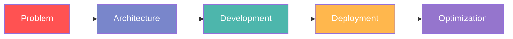

# 👨‍💻 Rohit Ganguly | psychic-coder

[](https://www.linkedin.com/in/rohit-ganguly-42685521b)
[](mailto:rohitganguly450@gmail.com)
[]()

## Full-Stack Developer specializing in modern web architectures

```typescript
class Developer {
  name: string = "Rohit Ganguly";
  alias: string = "psychic-coder";
  
  skills = {
    languages: ["JavaScript", "TypeScript", "Python", "Java", "C"],
    frontend: ["React", "Next.js", "Tailwind CSS", "Vite"],
    backend: ["Node.js", "Express", "MongoDB", "PostgreSQL", "Redis", "Prisma"],
    tools: ["Git", "Docker", "CI/CD", "Postman"],
    architecture: ["Microservices", "JAMstack", "Serverless", "OOP", "DSA"],
    
    getExpertise(): string {
      return "Building scalable applications with modern web technologies";
    }
  };

  constructor() {
    console.log("Ready to collaborate on innovative projects!");
  }
}

// Initialize developer instance
const rohit = new Developer();
```

## Tech Arsenal

<table>
  <tr>
    <td valign="top" width="33%">
      <h3>Frontend Ecosystem</h3>
      <div align="center">
        
        
        
        
        
      </div>
    </td>
    <td valign="top" width="33%">
      <h3>Backend & Database</h3>
      <div align="center">
        
        
        
        
        
        
      </div>
    </td>
    <td valign="top" width="33%">
      <h3>Core Languages</h3>
      <div align="center">
        
        
        
        
      </div>
    </td>
  </tr>
  <tr>
    <td valign="top">
      <h3>DevOps & Tools</h3>
      <div align="center">
        
        
        
        
      </div>
    </td>
    <td valign="top">
      <h3>Paradigms & Concepts</h3>
      <div align="center">
        
        
        
        
      </div>
    </td>
    <td valign="top">
      <h3>CI/CD & Cloud</h3>
      <div align="center">
        
        
        
        
      </div>
    </td>
  </tr>
</table>

## What I Do

Building digital experiences that matter through clean code and innovative solutions. Focused on creating scalable, maintainable applications with modern JavaScript ecosystems.



## Current Focus

- Building scalable microservices architectures
- Exploring edge computing and serverless paradigms
- Contributing to open-source projects
- Optimizing application performance and developer experience

## GitHub Stats

<div align="center">
  
</div>

<div align="center">
  
</div>

<div align="center">
  
</div>

> "Code is like humor. When you have to explain it, it's bad." – Cory House

Let's build something great together.
