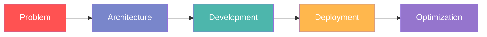

# 👨‍💻 Rohit Ganguly | psychic-coder

[](https://www.linkedin.com/in/rohit-ganguly-42685521b)
[](mailto:rohitganguly450@gmail.com)
[]()

## Full-Stack Developer specializing in modern web architectures

```javascript
const skills = {
  frontend: ["React", "Next.js", "TypeScript", "Tailwind CSS"],
  backend: ["Node.js", "Express", "MongoDB", "PostgreSQL", "Redis"],
  tools: ["Git", "Docker", "CI/CD", "Postman"],
  architecture: ["Microservices", "JAMstack", "Serverless"],
};
```

## Tech Arsenal

<table>
  <tr>
    <td valign="top">
      <h3>Frontend</h3>
      
      
      
      
    </td>
    <td valign="top">
      <h3>Backend</h3>
      
      
      
      
    </td>
    <td valign="top">
      <h3>DevOps & Tools</h3>
      
      
      
      
    </td>
  </tr>
</table>

## What I Do

Building digital experiences that matter through clean code and innovative solutions. Focused on creating scalable, maintainable applications with modern JavaScript ecosystems.



## Current Focus

- Building scalable microservices architectures
- Exploring edge computing and serverless paradigms
- Contributing to open-source projects
- Optimizing application performance and developer experience

## GitHub Stats


> "Code is like humor. When you have to explain it, it's bad." – Cory House

Let's build something great together.
